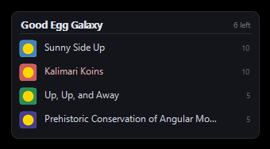
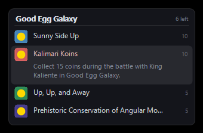

# Dolphin Achiever

Pops up the RetroAchievements you can still earn **right where you are**, the moment you
enter a level — with the badge art, the title and how to unlock it.



Hovering a row reveals how to unlock it:



Built for Dolphin + RetroAchievements. Game-agnostic: it learns each game's level layout
from the achievement set itself, so it is not hardcoded for any particular title.

---

## What it does

When you enter Good Egg Galaxy in *Super Mario Galaxy*, a small panel appears in the
corner listing what you can still earn there — one line each, badge, name and points.
Rest the mouse on a row and it expands to show how to unlock it.

When you then start a specific star/mission, anything tied to *that* section is shown
too. Already-earned achievements are filtered out, and missables are highlighted and
sorted first.

It is meant to sit alongside Dolphin's own achievement notifications, not compete with
them: same corner, same scale, gone in a few seconds. The panel anchors to **Dolphin's
picture**, not the desktop, and scales with it — so it stays put whether Dolphin is
windowed or fullscreen.

`DolphinAchiever.exe --demo` shows a sample panel so you can check placement without
playing.

The overlay is per-monitor DPI aware, so it renders at native resolution on scaled
displays instead of being bitmap-stretched.

## Design goals

- **Never modifies Dolphin.** Nothing is written into the Dolphin program folder, so
  Dolphin updates can't break it and it can't break Dolphin. Re-run `Install.ps1` after
  an update only if you moved Dolphin.
- **No dependencies.** Compiles with the C# compiler that ships in every Windows 10/11
  install. No .NET SDK, no runtime download, no Python, no DLLs. The built overlay is
  about 60 KB.
- **Idle until needed.** Starts with Dolphin, exits when Dolphin exits. While running it
  reads a few bytes of emulator memory a few times a second.
- **Read-only.** It never writes to Dolphin's memory and never touches your savegames.

## Install

```powershell
git clone https://github.com/MarkCockerill12/DolphinAchieveHelper
cd DolphinAchieveHelper
powershell -ExecutionPolicy Bypass -File .\Install.ps1
```

The installer finds Dolphin automatically (running process → common paths → registry →
shallow drive scan). Override with `-DolphinPath "D:\Emu\Dolphin-x64\Dolphin.exe"`.

Then launch with the **Dolphin (Achievements)** shortcut it creates.

Options:

| Flag | Meaning |
|---|---|
| `-DolphinPath <path>` | Point at a specific `Dolphin.exe` |
| `-Corner 0..3` | 0 = top-left, 1 = top-right, 2 = bottom-left, **3 = bottom-right** |
| `-Seconds 7` | How long the panel stays up (hovering holds it open) |
| `-Text hover` | `hover` (default), `always` to always show descriptions, `never` |
| `-NoFullscreenFix` | Don't touch Dolphin's borderless-fullscreen setting |
| `-NoShortcut` | Don't create shortcuts |

Uninstall with `.\Uninstall.ps1` — it restores Dolphin's logging settings and removes
everything.

### Prerequisites

- Dolphin with RetroAchievements enabled and signed in (Tools → Achievements).
- That's it. Your existing RA login is reused; no extra API key is needed.

## How it works

The interesting problem is that **RetroAchievements has no "which level is this
achievement for?" field.** That information only exists implicitly, inside each
achievement's trigger logic. Here is how it is recovered.

### 1. Getting the real trigger logic

The public Web API returns `MemAddr` as an **md5 hash** of the logic, which is useless
here. The Connect API (`dorequest.php?r=patch`) — the one emulators themselves use —
returns the actual trigger strings. Dolphin already stores a RetroAchievements username
and API token, so that endpoint is reachable with no extra setup.

### 2. Knowing which game is loaded

RetroAchievements identifies GameCube/Wii discs by hashing the executable inside the
disc image. Reimplementing that would mean decompressing RVZ/WIA containers. Instead,
Dolphin has *already done it* and logs the answer:

```
Identified game: 189 "Super Mario Galaxy" (4e0d0d2f2c5d3c13d758b027bbcc059f)
```

The installer enables that one log channel and the overlay reads the ID back out. If the
log is unavailable it falls back to matching the disc header's title against the
RetroAchievements game list.

### 3. Reading emulator memory

Dolphin's own achievement code reads guest memory as *physical* addresses, matching the
rcheevos console map (`0x00000000` = MEM1, `0x10000000` = MEM2 on Wii). The overlay
attaches read-only with `ReadProcessMemory` and locates emulated RAM by scanning for a
mapped region that begins with a valid GameCube/Wii disc header — magic `0xC2339F3D` at
`0x1C` or `0x5D1C9EA3` at `0x18`, plus a printable 6-character game ID.

Dolphin maps guest RAM into more than one arena, and only in the fastmem arena does
`MEM1 + 0x10000000` actually land on MEM2, so the correct arena is picked by requiring a
64 MB `MEM_MAPPED` region at that offset.

### 4. Working out where "here" is

This is the core trick. Achievements are parsed with a full rcheevos `MemAddr` parser,
then the overlay looks for **the pointer chain that the most achievements compare
against with the widest spread of constant values.** That chain is, by construction, the
game's "where am I" variable.

For *Super Mario Galaxy* it finds:

```
[0x6A1228] & 0x1FFFFFFF  ->  +0x24 & 0x1FFFFFFF
    +0x20, +0x23, +0x27, +0x2B   <- the stage name, as ASCII ("EggStarGalaxy")
    +0x40                        <- which star/mission
```

Reads that occupy adjacent bytes are clustered together, so the multi-word stage-name
string becomes one "level" key while the separate mission counter becomes a "section"
key. That is what makes the two-tier popup possible — level first, then section.

Games that use a simple flat `current_stage` byte fall out of the same algorithm with an
empty pointer chain, so nothing is special-cased.

Achievements state their location in two different ways, and both are handled:

```
0xG20=1164404563              "is EggStarGalaxy"
R:0xG20!=1164404563           "reset unless EggStarGalaxy"
N:0xG40!=1_R:0xG40!=4         "star 1 or star 4"
```

Handling the `ResetIf` form matters a lot: on *Super Mario Galaxy* it takes location
coverage from 50 to 123 of 161 achievements. Alt groups are handled too — plenty of sets
put a bare `1=1` in the core group and all the real logic in alts, and ignoring those
loses the level test entirely.

### 4b. Not showing the wrong level

Two rules keep false positives out, both learned the hard way:

**A partial name match is not an identity.** Where the level is named by text, an
achievement may compare only one 4-byte window of it. A window like the `Gala` of
`...Galaxy` is shared by dozens of level names, so such an achievement would pop
everywhere. Constraints are therefore ignored unless they either hit a
high-cardinality "anchor" key or cover a decent share of the identity bytes.

**A section belongs to a level.** An achievement constrained only to "mission 1" matches
mission 1 of *every* level, so the section pass also requires the level itself to match.
Without that check the section popup could list more achievements than the whole level
contained — which is exactly what it did before the check was added.

### 5. Naming the place

Trigger logic gives internal names like `EggStarGalaxy`. The friendly name comes from the
set's **Rich Presence script**, which the same Connect API call returns and which the
overlay parses and evaluates against live memory:

```
Mario is in Good Egg Galaxy "King Kaliente's Battle Fleet"
```

giving both the level and the section by their real names. If a game has no usable rich
presence, the internal name is prettified instead (`EggStarGalaxy` → `Egg Star Galaxy`).

### 6. Drawing it

A click-through (`WS_EX_TRANSPARENT`), always-on-top layered window, drawn with
`UpdateLayeredWindow` from a premultiplied-alpha DIB section. It can never take focus or
swallow a controller/keyboard input.

> Note: `Bitmap.GetHbitmap()` does **not** preserve alpha — `UpdateLayeredWindow`
> succeeds but composites the window as fully transparent. The surface must be a real
> `CreateDIBSection` bitmap in `Format32bppPArgb`.

## Accuracy

On *Super Mario Galaxy* (161 achievements), entering Good Egg Galaxy surfaces exactly the
7 achievements that belong to it — the 6 whose text names the galaxy, plus *"Up, Up, and
Away"* (the "Luigi on the Roof" star), which never mentions Good Egg by name and which
text matching would miss. Trigger parsing succeeds on 161/161.

Across seven GameCube and Wii sets (823 achievements) the trigger parser succeeds on all
of them, and location coverage is 62-123 achievements for *Super Mario Galaxy*,
*Super Mario Galaxy 2*, *Super Mario Sunshine*, *Mario Kart: Double Dash!!*,
*Kirby's Epic Yarn* and *Sonic and the Secret Rings*.

Coverage depends on the set. Achievements with no location condition ("collect 120
stars") are global and are never popped. `tools/Audit.exe <cached patch json>` reports
the discovered keys, per-level matches and an accuracy estimate for any set.

## Limitations

- **Windows only** — it uses `ReadProcessMemory` and Win32 layered windows.
- **Exclusive fullscreen hides every overlay**, and Dolphin's fullscreen *is* exclusive:
  the Vulkan backend calls `vkAcquireFullScreenExclusiveModeEXT`, and D3D calls
  `IDXGISwapChain::SetFullscreenState`. Dolphin's own "Borderless Fullscreen" option
  cannot help - `bBorderlessFullscreen` is written to the config but **never read by any
  backend**. So the overlay takes over **Alt+Enter** itself (a system-wide hotkey, so
  Dolphin never sees the key and never requests exclusive mode) and instead strips
  Dolphin's window border and sizes it to the monitor. Same appearance, but it
  composites, so the overlay is visible. Pass `--no-fs-hotkey` to disable.
- A game whose achievement set never tests a shared location variable can't be mapped.
  The overlay says so in its log and stays quiet rather than guessing.
- If Dolphin runs elevated, run the overlay elevated too, or it cannot read its memory.

## A note on hardcore mode

This is a **read-only observer**. It does not write emulator memory, alter savestates or
interact with the achievement runtime, and it shows only the achievement titles and
descriptions that RetroAchievements already publishes and that Dolphin's own achievement
list displays. It does not reveal trigger conditions or give any information you could
not get by opening the game's page on retroachievements.org.

## Layout

```
Install.ps1 / Uninstall.ps1   installer and clean removal
src/
  MemAddr.cs                  rcheevos trigger/value parser
  RcEval.cs                   evaluator: pointer chains, typed reads, comparisons
  LocationMatcher.cs          location-key discovery and achievement matching
  RichPresence.cs             rich presence parser + evaluator
  DolphinMemory.cs            process attach, arena discovery, guest memory reads
  DolphinInstall.cs           finding Dolphin and its config
  RaClient.cs                 RetroAchievements Connect API + caching
  GameIdWatcher.cs            game ID from Dolphin's log
  Toast.cs                    the overlay window
  Program.cs                  orchestration
tools/                        development probes and test harnesses
```

Runtime data (cache, badges, log) lives in `%LOCALAPPDATA%\DolphinAchiever`.

## Development

```powershell
# rebuild
.\Install.ps1

# inspect what the matcher finds for a cached game, live
.\tools\build-tools.ps1
.\tools\TestMatch.exe "$env:LOCALAPPDATA\DolphinAchiever\cache\patch_189.json"
```

`TestMatch` prints the discovered location keys, their live values, the decoded rich
presence, and the achievements matching your current position — the fastest way to see
why a game does or doesn't work.

## License

MIT
