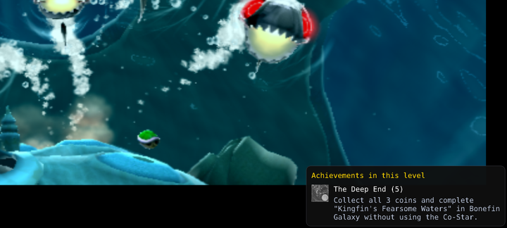
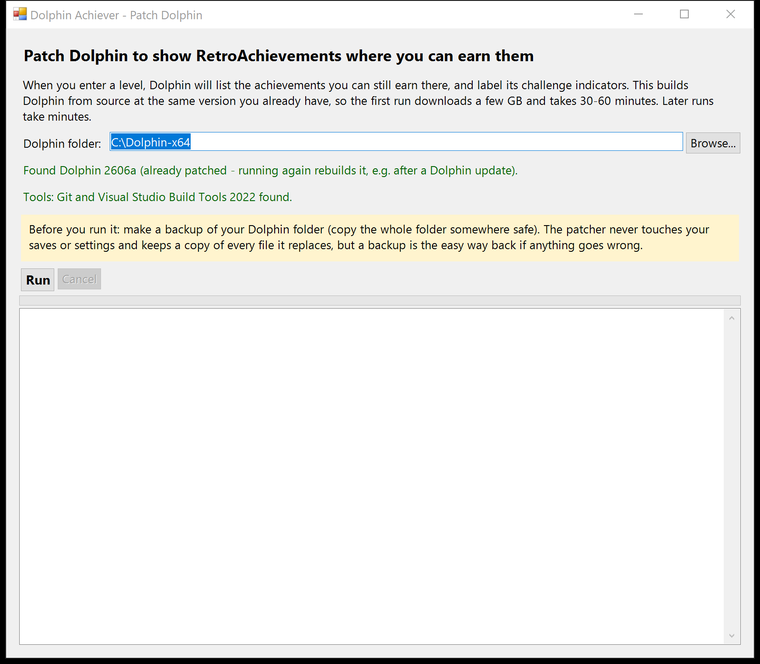
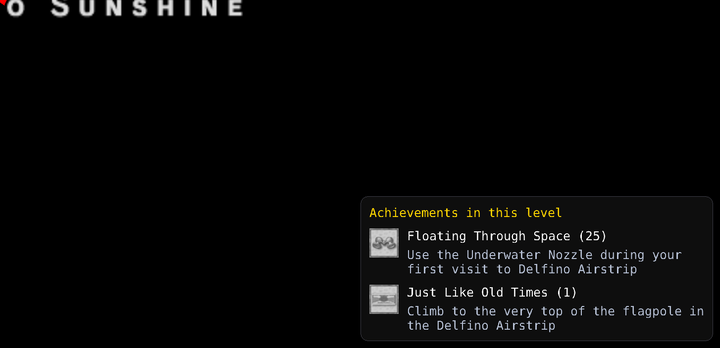

# Dolphin Achiever

Patches the [Dolphin](https://dolphin-emu.org) emulator so that, when you enter a level, it
lists the [RetroAchievements](https://retroachievements.org) you can still earn **right
there**: badge, title, points and how to unlock it. That includes the ones that would
otherwise only appear once you have already earned them.



It also puts the name and unlock condition next to Dolphin's challenge indicators, the
bare badges Dolphin shows while a timed or no-damage challenge is running.

It is drawn by Dolphin's own on-screen display, so it works in windowed mode, fullscreen and
exclusive fullscreen alike. Nothing extra runs alongside Dolphin.

---

## How to use

You need Windows 10 or 11 (64-bit), an internet connection and about 10 GB of free disk space.

1. **Download** this repository (green *Code* button, *Download ZIP*) and unzip it anywhere.
2. **Double-click `Patch Dolphin.cmd`.** The patcher window opens.

   

3. **Pick your Dolphin folder**, the one that contains `Dolphin.exe`. The window shows
   which Dolphin version it found.
4. If it says tools are missing, press **Install missing tools**. It installs
   [Git](https://git-scm.com) and Microsoft's *Visual Studio Build Tools* (C++), which are
   needed to build Dolphin. Windows asks for permission, and the Build Tools are a few GB.
5. **Back up your Dolphin folder**: copy the whole folder somewhere safe. The patcher never
   touches your saves or settings and keeps its own copy of every file it replaces, but a
   backup is the simple way back if anything goes wrong.
6. **Press Run.** The first run downloads Dolphin's source (a few GB) and builds it, which
   takes 30-60 minutes. The log shows what it is doing. Later runs take a few minutes.
7. **Start Dolphin as usual.** Log in to RetroAchievements in Dolphin
   (*Tools > Achievements*) if you have not already.

Make sure *Config > Interface > Show On-Screen Display Messages* is on, because the list is
an on-screen message. For the labelled challenge indicators, also keep
*Tools > Achievements > Enable Challenge Indicators* on.

### Updating Dolphin

Update Dolphin however you normally do, then run the patcher again. It always builds the
exact version you have installed, so it keeps working across Dolphin releases and
development builds. A patched Dolphin never updates itself; the patcher also switches the
auto-updater off if your settings name an update track.

If a future Dolphin changes the code the patches modify, the patcher stops **before touching
your install** and says the patches need updating for that version.

### Undoing it

Every file the patcher replaces is kept in `<your Dolphin folder>\DolphinAchiever-backup\<date-time>\`.
Copy those files back over your Dolphin folder, restore your backup, or reinstall Dolphin.

### Without the window

```powershell
.\patcher\Build-PatchedDolphin.ps1 -Install "C:\Path\To\Dolphin"
```

`-WorkDir` sets where the source is built (default `%USERPROFILE%\dolphin-patched-build`,
kept between runs so later runs are fast). `-Ref <tag or commit>` builds a specific Dolphin
version instead of the installed one.

---

## What you see

When you arrive somewhere with locked achievements, a panel appears in the bottom-right
corner, above the challenge indicators, for 6 to 15 seconds depending on how much it lists.

- It lists only what can be earned **exactly where you are**: the current level *and*
  mission. In *Super Mario Galaxy* that is the galaxy plus the star you picked; in
  *Sunshine* the area plus the episode.
- Missable achievements come first, then by points.
- Anything already shown as a challenge indicator is left out, and anything you unlock while
  the panel is up disappears from it.
- It appears again when you reach somewhere with something new, and when you come back to a
  level after a menu or loading screen.



---

## How it works

### Building Dolphin at your version

`Dolphin.exe` embeds its version name and the exact source commit it was built from. The
patcher reads those, downloads Dolphin's source at that commit, applies two patches, builds
it with Visual Studio's C++ tools and copies in only the files that differ. Your saves,
settings and the rest of the install are untouched. Building from your own version, not
shipping a prebuilt exe, is what keeps it working after Dolphin updates.

| Patch | What it does |
|---|---|
| `patches/challenge-details.patch` | Draws the title and description next to each challenge indicator. |
| `patches/level-banner.patch` | Adds `Core/LocationTracker`, which works out which achievements belong where you are, and draws the list. |

### Working out where you are

Nothing is written for any particular game. The location is inferred from the achievement
set itself, reusing the triggers Dolphin's achievement library (rcheevos) has already parsed
and the memory values it refreshes every frame.

1. **Collect location clues.** Every achievement trigger is scanned for comparisons of a
   memory value against a constant, one chain of conditions at a time:
   - `stage = 12` must hold;
   - `ResetIf stage != 12` means "only in stage 12";
   - `AndNext stage != 3, ResetIf stage != 4` means "stage 3 or 4";
   - `OrNext stage = 3, stage = 5` means "stage 3 or 5".

   Chains with hit counting are skipped rather than guessed at. Reads of the previous frame's
   value count too; when "previous" and "current" disagree ("reach B from A"), the starting
   place is used.
2. **Find the game's "where am I".** Games keep their location behind a pointer chain or at
   a fixed address. The one that the most achievements compare against the widest spread of
   constants wins. Every value there that takes two or more settings is a location key. One
   with five or more is *strong*: it can name a place by itself (a stage id, a stage name held
   as text, a mission number with many values).
3. **Match.** An achievement belongs to where you are when every one of its location
   constraints holds and at least one of them is on a strong key. That second rule stops "the
   second mission" alone from placing an achievement in the second mission of every level.
4. **Show.** Each frame, right after the achievements are processed, the keys are read and
   the matching list is recomputed. Once the list has been stable for 45 frames (levels are
   briefly inconsistent while loading) and contains something new, the panel appears. Zeroed
   memory straight after boot is ignored.

Each time the panel appears, Dolphin logs a line like
`Location tracker: 3 achievements here [...]` on the RetroAchievements log channel, with the
raw values it read. That line is the first thing to look at if a level shows nothing.

---

## Tested games

Checked offline against each game's real achievement set. *Placeable* means the achievement
can be tied to somewhere specific.

| Game | Placeable | What it uses as "where" |
|---|---|---|
| Super Mario Galaxy | 136 / 161 | galaxy name + star. 94 of the 97 achievements whose description names a galaxy land in that galaxy, none in a wrong one |
| Super Mario Galaxy 2 | 63 / 101 | world + galaxy |
| Super Mario Sunshine | 82 / 149 | area + episode (e.g. Ricco Harbor episode 8) |
| Kirby's Epic Yarn | 35 / 62 | stage: each stage, boss fight and Kirby's Pad |
| Kirby's Return to Dream Land | 37 / 96 | stage |
| The Legend of Zelda: Twilight Princess (GameCube) | 127 / 150 | stage name (Ordon, Castle Town shops, dungeon rooms...) |
| The Legend of Zelda: Twilight Princess (Wii) | 97 / 108 | stage |
| Mario Kart: Double Dash!! | 58 / 66 | cup + engine class |
| Mario Kart Wii | 96 / 203 | character + vehicle + track |

Also run in Dolphin: *Super Mario Galaxy* (Bonefin Galaxy shows its achievement),
*Super Mario Sunshine* (Delfino Airstrip), and *Kirby's Epic Yarn*, *Twilight Princess* and
*Mario Kart Wii* loading correctly and staying quiet on menus.

### Known limits

- **Save-file totals can't be placed**, e.g. "gold medal in every stage in Grass Land" or
  "collect 50% of the Fabric". Their triggers only count save data and never read where you
  are.
- **Mario Kart Wii** ties most achievements to a character + kart + track combination, so
  they show once you are racing that combination, not merely on that track.
- In **Super Mario Sunshine** the title screen *is* Delfino Airstrip, so the Airstrip
  achievements show there, and are not repeated when you then land at the Airstrip.
- A few achievements are tied to a momentary game state (e.g. Twilight Princess's
  "Obtain the Fused Shadow in ..."), so they show as it happens rather than beforehand.
- Leaving and re-entering the same level without passing a menu or loading screen does not
  show the list again.

---

## Repository layout

| Path | What |
|---|---|
| `Patch Dolphin.cmd` | Double-click to open the patcher window |
| `patcher/PatcherGui.ps1` | The window |
| `patcher/Build-PatchedDolphin.ps1` | Does the work: detect, fetch, patch, build, install |
| `patcher/PatcherCore.ps1` | Shared helpers (version detection, finding Git and Visual Studio) |
| `patcher/patches/` | The two Dolphin patches |

## License

MIT for this repository. Dolphin itself is GPL-2.0-or-later; the patches are contributions
to it under the same license.
